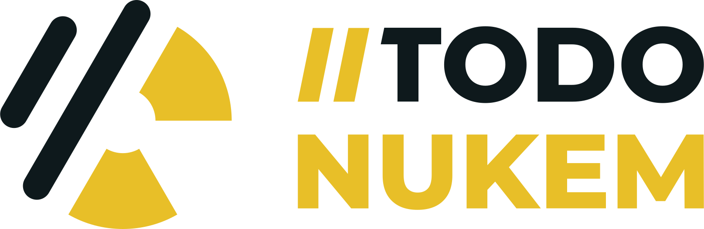
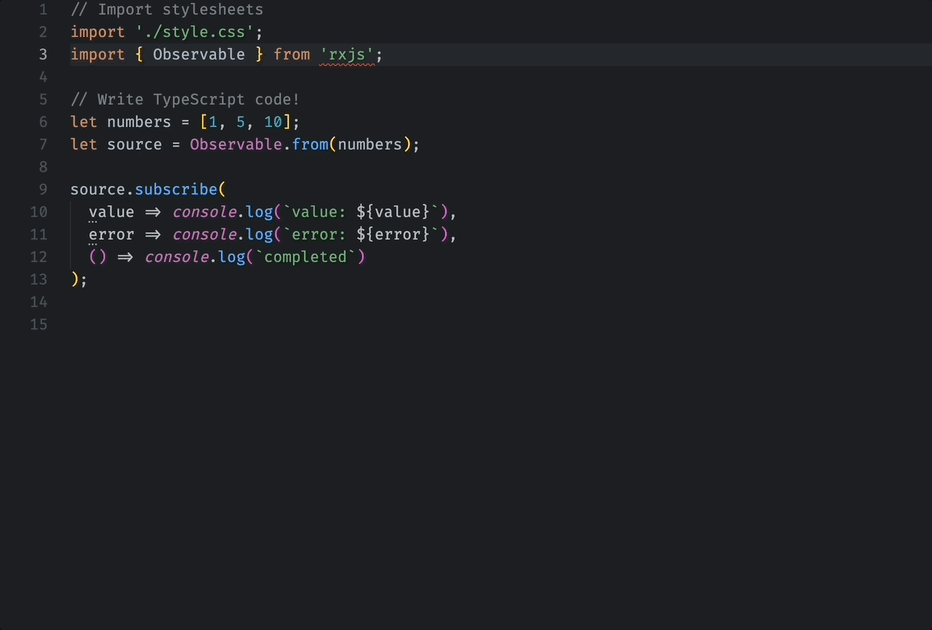
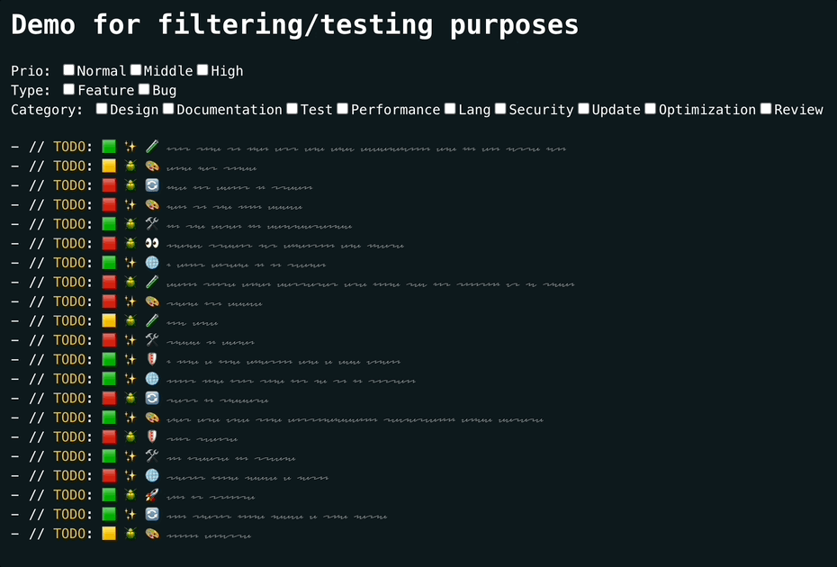

<p align="center">
    
</p>

<div align="center">

[](https://conventionalcommits.org)
<!-- ALL-CONTRIBUTORS-BADGE:START - Do not remove or modify this section -->
[](#contributors-)
<!-- ALL-CONTRIBUTORS-BADGE:END -->

</div>

# Coding Comments Convention

**Working Draft**

A specification for enhancing TODO messages with emojis for easier comprehension and organization.

## Usage

| Package | IDE / Environment | Description | Status |
|---------|-------------------|-------------|--------|
| [VSCode Extension](https://github.com/jolution/todo-nukem-vscode) | Visual Studio Code | Generator, viewer and snippets for the TODO Nukem convention | Alpha |
| [ESLint Rule](https://github.com/jolution/eslint-plugin-todo-nukem) | ESLint | Custom rule to validate the convention | Alpha |
| [Copilot Instructions](./.github/copilot-instructions.md) | Copilot | Instructions for using TODO Nukem convention with Copilot | Alpha |
| [PR Ticket Link Action](./github-actions/pr-ticket-link) | GitHub Actions | Automatically adds ticket links to Pull Request descriptions based on branch names | Alpha |


### Technical integration

#### Block-Commit (Commit Guard)

The `[block-commit]` meta block is used to prevent a commit if this marker is present in the code. This is intended as a safety mechanism for critical TODOs that must be resolved before code can be committed.

**Note:** This block does not work out of the box. You need to configure your tooling (e.g., git hooks) to enforce this rule. For example, with [lefthook](https://github.com/evilmartians/lefthook), you can block commits containing this marker.

**Example in source code:**

```js
// TODO: [low] [fix] [optimize] Fix this logic [block-commit]
```

**Visual display (with decorations):**

```js
// TODO: 🟩 🐛 🛠️ Fix this logic ⛔
```

<details>
<summary>Example solution: Commit blocking with lefthook</summary>

```yaml
commands:
  block-commit-check:
    run: |
      MARKER="[block-commit]"
      if grep -l "$MARKER" {staged_files} 2>/dev/null; then
        echo "⛔ Commit blocked: Found '$MARKER' marker in staged files"
        echo "Please resolve all TODOs with '$MARKER' before committing"
        echo ""
        echo "Found in:"
        grep -Hn "$MARKER" {staged_files} 2>/dev/null
        echo ""
        echo "This blocking is based on TODO NUKEM convention."
        echo " Learn more: https://github.com/jolution/todo-nukem/blob/main/README.md"
        exit 1
      fi
```

</details>

## 📚 Summary

The TODO NUKEM specification is a lightweight convention applied to TODO comment messages. It offers straightforward guidelines for crafting feature-rich comments, facilitating the development of automated tools. Designed for rapid visual comprehension of tasks, this convention may enhances efficiency in coding.

## 🧠 Anatomy

The comment message should be structured as follows:

### 📝 Code

**In source code:**

```
// TODO: [priority] [type] [context] <description> [optional meta]
```

**Visual display (with decorations):**

The extension decorates the keys with emojis in the editor, so you see:

```
// TODO: 🟩 ✨ 🛠️ <description> [optional meta]
```

> **Note:** You can customize the display mode in `.todonukem.json` (project-wide) or `.todonukem-local.json` (local, not committed) for emoji, text, or emoji-text combination.

## 🌟 Examples

**In source code:**

```
// TODO: [low] [feature] [optimize] Gear up and get ready to "Hail to the king, baby!" as I kick some alien behind
```

```
// TODO: [medium] [fix] [update] It's time to chew bubble gum and kick ass, and I'm all outta gum
```

**Visual display (with decorations):**

```
// TODO: 🟩 ✨ 🛠️ Gear up and get ready to "Hail to the king, baby!" as I kick some alien behind
```

```
// TODO: 🔶 🐛 🔄️ It's time to chew bubble gum and kick ass, and I'm all outta gum
```

## Required classification Blocks

### 1: Prio

This block is used to indicate the priority of a task. It uses three different emojis to represent low (🟩), medium (🔶), and high (🔴) priority levels.

Instead of using the same shape like `🟩 🟨 🟥`, we pick `🟩 🔶 🔴` with different shapes so that the distinctions are not solely based on the colors red and green, especially considering color blindness.

| Emoji | Key         | Desc    |
| ----- | ----------- | ------- |
| 🟩    | `[low]`     | Default |
| 🔶    | `[medium]`  |         |
| 🔴    | `[high]`    |         |

### 2: Type

This block is used to specify the type of task. It uses two emojis to represent a feature (✨) and a fix (🐛).

| Emoji | Key         | Desc    |
| ----- | ----------- | ------- |
| ✨    | `[feature]` | Default |
| 🐛    | `[fix]`     |         |

### 3: Context

This block is used to provide context for the task. It uses a variety of emojis to represent different contexts such as design (🎨), documentation (📝), testing (🧪), performance (🚀), language (🌐), security (🛡), update (🔄), optimization (🛠), and review (👀).

| Emoji | Key          |
| ----- | ------------ |
| 🎨    | `[design]`   |
| 📝    | `[doc]`      |
| 🧪    | `[test]`     |
| 🚀    | `[perf]`     |
| 🌐    | `[lang]`     |
| 🛡     | `[sec]`      |
| 🔄    | `[update]`   |
| 🛠     | `[optimize]` |
| 👀    | `[review]`   |

## Optional Meta Blocks

We are in an early testing phase so this block is still incomplete.

We are happy to receive feedback on this.

| Type                | Example       | Desc                                                                                                          |
|---------------------|---------------|---------------------------------------------------------------------------------------------------------------|
| To Be Discussed (TBD) | `[tbd]`      | This block is used when a task needs further discussion. It is represented by the 💬 emoji.                   |
| Scope               | `[scope: ThisComponent]` | This block is used to specify the scope of a task. It is represented by the 🎯 emoji.                         |
| Ticket              | `[ticket: TDN-123]` | This block is used to link a task to a specific ticket. It is represented by the 🎫 emoji. |
| Until               | `[until: 2025-Q1]`  | This block is used to specify a deadline for a task. It is represented by the 📅 emoji.                       |
| Assignee            | `[assignee: Name]` | This block is used to assign a task to a specific person. It is represented by the 👤 emoji. |
| Author              | `[author: Name]`   | This block is used to indicate the author of a task. It is represented by the ✍️ emoji.     |
| Version             | `[version: v1]`       | This block is used to specify the version of a task. It is represented by the 🔖 emoji.                       |
| Docs                | `[docs]`     | This block is used to indicate that a task is related to documentation. It is represented by the 📚 emoji.    |
| Block-Commit     | `[block-commit]` | This block is used to prevent a commit if this Block is set. It is represented by the ⛔ emoji. This only works with additional configuration for Git hooks tools and does not work out of the box.   |

## Some Elements missing?

Are you missing an important emoji? Then take a look at the Contribution Guidelines and create a new issue or pull request.

```
| 📦    | Context.Package  | Package |
```

e.g.

```
| ⬛    | Prio.Unknown | Unknown |
```

## ✨Features

Why Use this Comment Convention

- quick visual capture of the task
- Later possible filtering of tasks by areas
- Meta information

### 🎬 Demo

#### Generate Comment



#### Filtering

_The following is just a demo of what filtering could look like functionally in the future:_

You see here an old state of the prio emojis.



## ❓FAQ

<details>
<summary>Why do you use the choice between bug and feature as the second information in the classification block and not simply TODO and FIXME?</summary>
<p>The developers surveyed so far said they rarely use FIXME. We have therefore currently decided to have the most comprehensive convention possible. In the future, we plan to make this adjustable per project. Therefore, this is only the default case.</p>
</details>

<details>
<summary>What is the difference between the review and the TBD emoji?</summary>
<p>Review is when the category is not yet available. TBD is more likely to be additional when the category is already clear. But this may change in the future version.</p>
</details>

<details>
<summary>How did you choose the emojis?</summary>
<p>We compared many emojis and ensured that they were similar in size. These were then shown to a few developers to make a general selection.
For example, the green and red emoji are not ideal for people with red/green weakness. We are therefore already working on a setting option at project level. Here you could then choose between emoji-only, text-only and or text-emoji combination for each project. But this is an option for the future.</p>
</details>

For more questions and answers, please visit our [Q&A Discussions](https://github.com/jolution/todo-nukem/discussions/categories/q-a).

## 📃 Specification

The specification builds on existing TODO messages.

**In source code format:**

After the "TODO:" there is a space and then the first classification block.

The classification block contains exactly 3 keys in square brackets: `[priority] [type] [context]`. These are separated from each other by a space.

This is followed by the message as usual.

The meta block follows the message. This is optional.
Here a unit of the block begins with square brackets. Within the square brackets you start with the appropriate key (e.g., `[ticket: ...]`, `[until: ...]`, etc.). A space is placed after the closed bracket if another unit follows. Of course, there doesn't have to be a space at the end.

**Visual display:**

The VSCode extension and other tools can decorate the keys with emojis for better visual comprehension while keeping the source code clean and readable.

The language is English. This also applies to the date or quarter format.

## 🗺️ Roadmap

- Surveys and data are currently being collected
- Add integrations (linter, generator, report ...)
- Testing and feedback

### 🌱 Possible future adaptation

#### Guards

For those who want to use this convention only in dev branches and not in main/production, we are planning to build guards that prevent comments from being merged into main.
e.g. like GitHub(...) actions or git hooks.

#### Text only, and text-emoji combination variant

A `text only`, and `text-emoji` combination variant is available via the `.todonukem.json` (project-wide) or `.todonukem-local.json` (local, not committed) configuration file as an alternative to the `emoji only` mode (default).

Display modes:

- **Emoji only** (default): `🟩 ✨ 🧪`
- **Text only**: `Low Feature Test`
- **Emoji-text combination**: `🟩-low ✨-feature 🧪-test`

Configure via `.todonukem.json` (project-wide, committed) or `.todonukem-local.json` (local, gitignored):

```json
{
  "displayMode": "emoji-text"
}
```

> **Note:** `.todonukem-local.json` takes precedence over `.todonukem.json` and is intended for personal preferences without affecting the team configuration.

#### Project configuration

The plan is for this to depend on the project configuration in the project configuration file, for example it could be called todonukem.json or commentsconvention.json (with or without trailing dot for the filename) for a general naming. But that's just an idea so far and not part of this version.

#### User configuration

At some point, it would also be great if, as discussed in step 2, we could have not only a project-level config but also a user-level config that can override the default and project config. For example, if a user prefers a different config than the rest, we could use text-only as a basis by default, and then through our future extensions, provide a different visual variant without changing the code.

## ❤️ Support

If you find this project helpful, please consider giving it a star on [GitHub](https://github.com/jolution/todo-nukem).

[](https://github.com/jolution/todo-nukem)

We do not currently offer direct support for this project.

## ✍️ Authors (in alphabetical order)

- [@juliankasimir](https://www.github.com/juliankasimir)
- [@pimmok](https://www.github.com/pimmok)

## 💎 Sponsor

### Atos

We appreciate the support from [Atos](https://atos.net), helping us continue our open source work.

## ⚖️ License

See the [LICENSE](LICENSE) file for details.

## ℹ️ Disclaimer

Please note that this project, TODO NUKEM, is not officially associated with or endorsed by the Duke Nukem franchise or its creators. It is an independent project developed by the open-source community and does not claim any rights to the Duke Nukem trademark or any related materials.

## ✨ Contributors

Thanks goes to these wonderful people ([emoji key](https://allcontributors.org/docs/en/emoji-key)):

<!-- ALL-CONTRIBUTORS-LIST:START - Do not remove or modify this section -->
<!-- prettier-ignore-start -->
<!-- markdownlint-disable -->
<table>
  <tbody>
    <tr>
      <td align="center" valign="top" width="14.28%"><a href="https://jochensimon.com/"><br /><sub><b>Jochen Simon</b></sub></a><br /><a href="#ideas-pimmok" title="Ideas, Planning, & Feedback">🤔</a> <a href="#design-pimmok" title="Design">🎨</a> <a href="https://github.com/jolution/todo-nukem/commits?author=pimmok" title="Code">💻</a></td>
      <td align="center" valign="top" width="14.28%"><a href="https://github.com/juliankasimir"><br /><sub><b>Julian Kasimir</b></sub></a><br /><a href="#ideas-juliankasimir" title="Ideas, Planning, & Feedback">🤔</a> <a href="#design-juliankasimir" title="Design">🎨</a> <a href="https://github.com/jolution/todo-nukem/commits?author=juliankasimir" title="Code">💻</a></td>
      <td align="center" valign="top" width="14.28%"><a href="https://github.com/noahimwind"><br /><sub><b>Noah Duerkes</b></sub></a><br /><a href="https://github.com/jolution/todo-nukem/pulls?q=is%3Apr+reviewed-by%3Anoahimwind" title="Reviewed Pull Requests">👀</a></td>
    </tr>
  </tbody>
</table>

<!-- markdownlint-restore -->
<!-- prettier-ignore-end -->

<!-- ALL-CONTRIBUTORS-LIST:END -->

This project follows the [all-contributors](https://github.com/all-contributors/all-contributors) specification. Contributions of any kind welcome!
